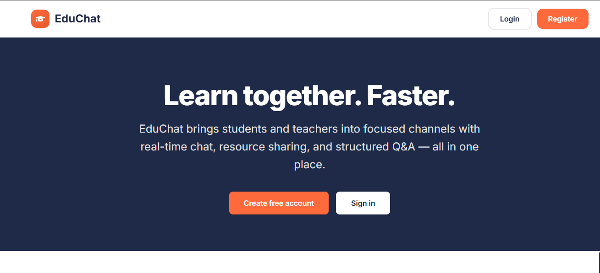
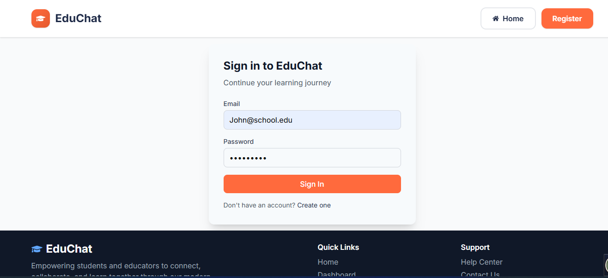
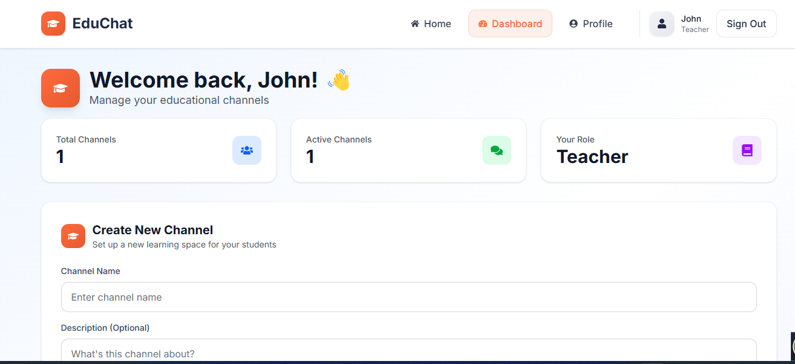
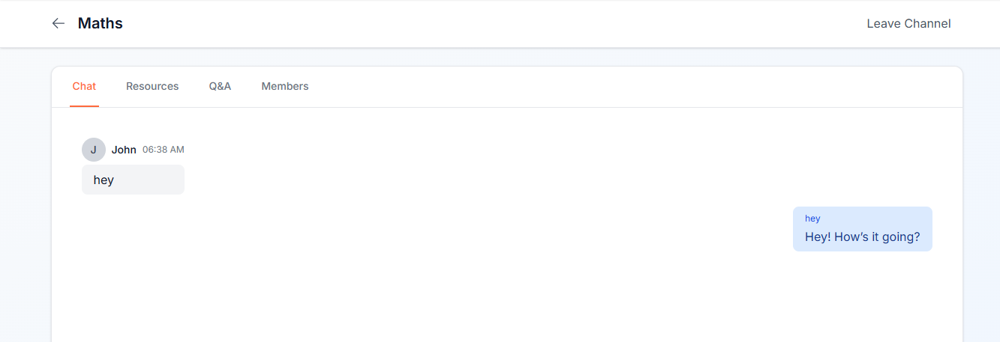
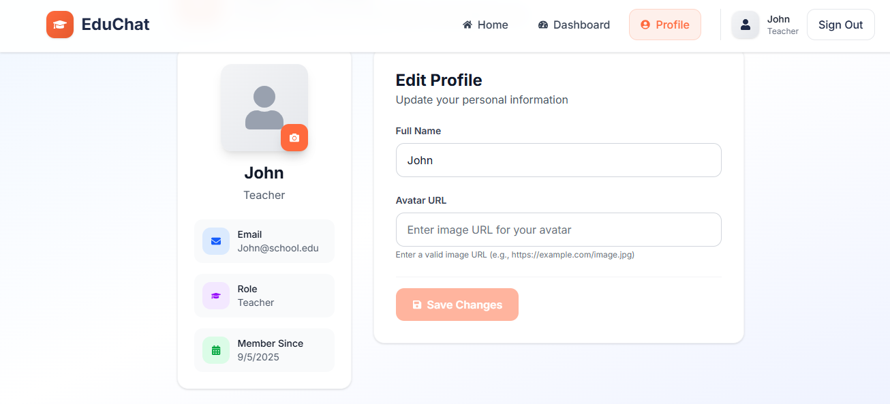
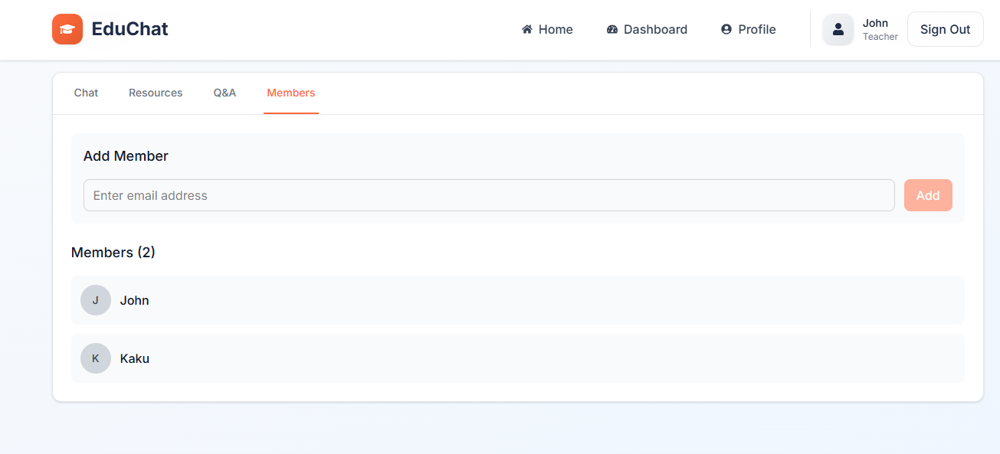
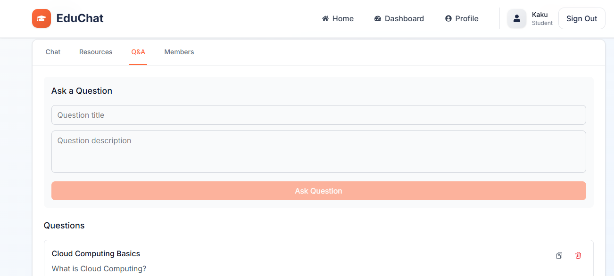
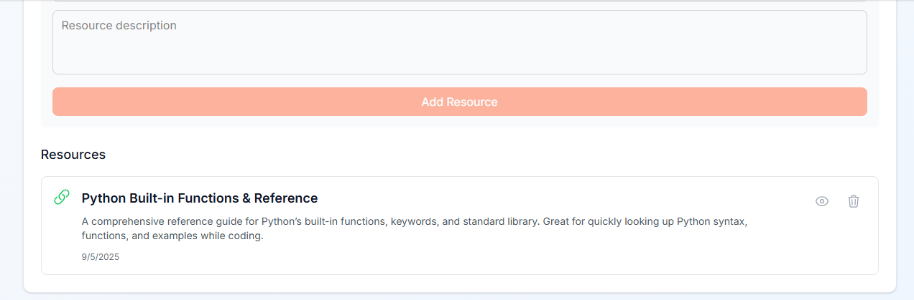

# 🎓 EduChat - Educational Chat Platform
> ⚠️ **Note:** The working code is in the `main` branch. Other branches are for development or testing purposes and may not be fully functional. Please use the `main` branch.

A full-stack educational chat application built with Next.js featuring real-time communication, study groups, and resource sharing.

## 🚀 Features

- **Fullstack with Next.js 15: One unified project handling both frontend and backend
- **Modern UI/UX: Built with Tailwind CSS for a responsive, mobile-first design
- **Real-time Chat: Powered by Socket.IO for instant messaging
- **Authentication: Secure login/register system with JWT
- **Study Groups: Create and join collaborative learning spaces
- **Resource Sharing: Upload and share educational materials (images, documents, etc.)
- **Q&A Forum: Interactive question-and-answer system
- **Database: PostgreSQL with Prisma ORM for type-safe queries and migrations
- **API Security: Secure API routes, including rate limiting to prevent abuse


## 🛠️ Tech Stack

### Fullstack with Next.js

- **Next.js 15 – React framework with App Router for fullstack development
- **React 19 – Latest React with modern features
- **Tailwind CSS 4 – Utility-first CSS framework for responsive design
- **Framer Motion – Animation library for interactive UI
- **React Icons – Icon library for UI components
- **Socket.IO – Real-time bidirectional communication
- **PostgreSQL – Relational database for structured data
- **Prisma ORM – Type-safe database client with migrations
- **JWT – Secure authentication using JSON Web Tokens
- **Bcrypt – Password hashing for user security
- **Multer / Next.js API Routes – File upload handling (images, documents, etc.)

## 📦 Installation

### Prerequisites
- Node.js 18+ 
- PostgreSQL (local or cloud instance)
- Git
- Prisma CLI (optional, for migrations and database management)

### 1. Clone the repository
```bash
git clone <repository-url>
cd education-chat-app
```

### 2. Install Dependencies
```bash
# Navigate to the project root
cd your-project-name

# Install all dependencies (frontend + backend)
npm install
```

### 4. Environment Setup
```bash
cp env.example .env
# Edit .env with your configuration
```

### 5. Start Development Servers

#### Next.js App (Frontend + API Routes)
```bash
# From the project root
npm run dev
# The app will run on http://localhost:3000
```

## 🔧 Configuration

### Next.js (Frontend + API Routes) Configuration
- Edit `next.config.mjs` for Next.js settings
- Modify `tailwind.config.js` for styling customization
- Update `/src/app/layout.js` for global layout changes

### Server Scripts Configuration
- Configure database connection in `.env`
- Set JWT secret and expirations
- Adjust rate limiting and security settings

## 📱 Usage
### Teacher Role
1. **Register/Login**: Create an account or sign in
2. **Create Channels/Study Groups**: Set up new channels for students
3.  **Add Members**: Assign students to specific channels
4. **Share Resources**: Upload and share educational materials with channel members
5. **Answer Questions**: Respond to questions posted in the Q&A forum
6.  **Start Chatting**: Real-time communication with group members
7. **Collaborate**: Work together on projects and assignments
   
### Student Role
1. **Register/Login**: Create an account or sign in
2. **Access Channels/Study Groups**: Join channels created by teachers
3. **Start Chatting**: Real-time communication with group members
4. **Access Resources**: View and download materials shared by teachers
5. **Ask Questions**: Post questions in the Q&A forum
6. **Answer Questions**: Respond to questions from peers
7. **Collaborate**: Work together on projects and assignments
 

## 🚀 Deployment

### Frontend Deployment
```bash
# Build the Next.js app
npm run build

# Start the app locally (frontend + backend API routes)
npm start
```

### Environment Variables for Production
- Set `NODE_ENV=production`
- Use the Neon PostgreSQL URI for DATABASE_URL
- Set strong JWT secrets

## 👥 Contributors

| Contributor | Role |
|-------------|------|
| [Kaku Temesgen](https://github.com/fenitamas) | Frontend & Backend |
| [Beamlak Sintayehu](https://github.com/beamlaksinta) | Frontend |
| [Bethlehem Adugna](https://github.com/Betheel1) | Frontend |

## 🎥 Demo Video

[Download & Watch the Demo](https://drive.google.com/file/d/1TUjDb85gasN3w3dnInvgsC77E7bEWFxU/view?usp=sharing)


## 📸 Screenshots










## 🤝 Contributing

1. Fork the repository
2. Create a feature branch
3. Make your changes
4. Test thoroughly
5. Submit a pull request

## 🆘 Support

For support and questions:
- Create an issue in the repository
- Check the documentation
- Contact the development team

---

**Built with ❤️ for the educational community**
